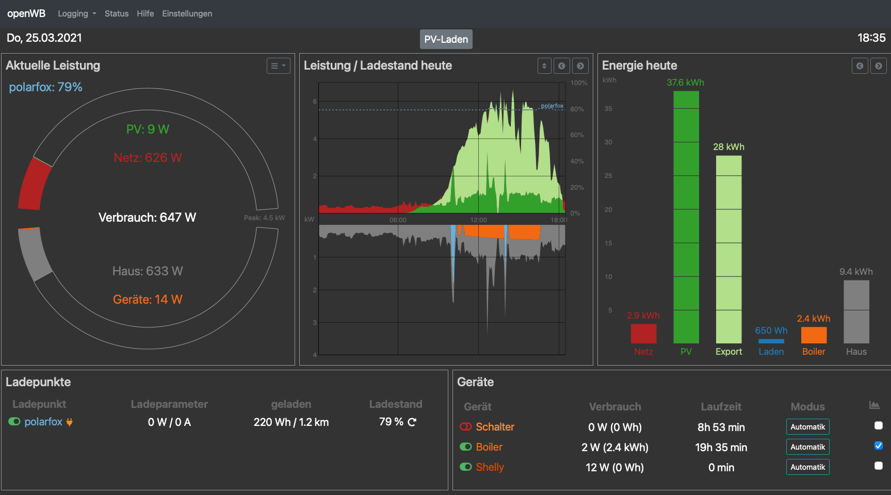

# wbcolortheme
Ein Theme für die OpenWallbox (www.openwallbox.de)

Zum Testen.

## Verwendung:
Kopiere das "colors"-Verzeichnis mit allen Files in das "themes"-Verzeichnis der openWB (/var/www/html/openWB/web/themes).

## Release Notes:
Dies ist eine Testversion des Themes

Derzeit werden noch nicht alle Features der Standard-Themes angeboten, teiweise mangels Test-Möglichkeiten des Entwicklers.

Grundlegende EVU- und PV-Daten, Ladepunkte, Verbraucher, Smarthome-2.0 werden angezeigt und sind teilweise auch manipulierbar.

## Feedback ist willkommen (hier oder übers openWB-Forum)
